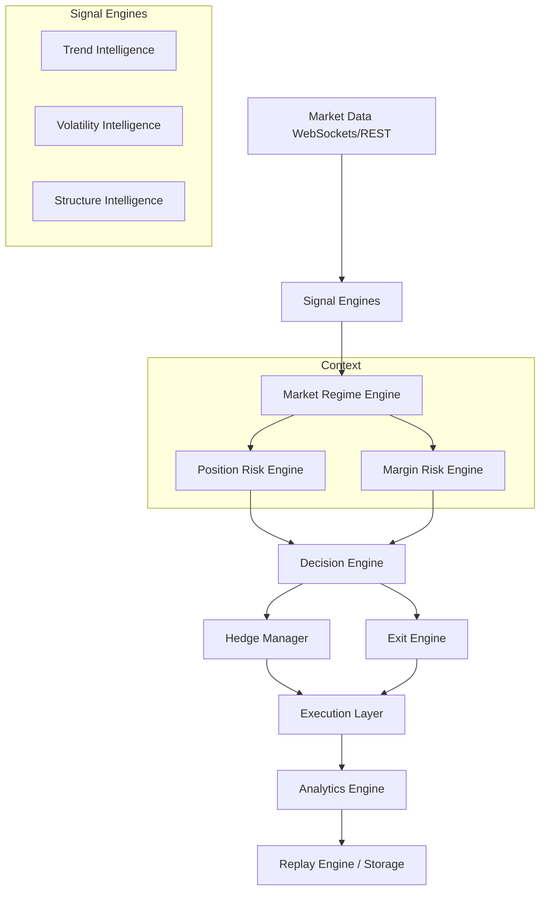

# ARES Trading Intelligence Specification

This document serves as the master blueprint for the **Adaptive Risk & Execution System (ARES)**. It outlines the foundational architecture, functional specifications, and data flow of the intelligence layer. 

---

## 1. Market Regime

The Market Regime Engine is the core state machine of ARES, identifying the macro environment to dictate overarching risk and hedging posture.

### SAFE_RANGE
- **Meaning:** Price is oscillating within a defined, predictable band with low volatility.
- **Objective:** Maximize premium decay (theta).
- **Risk to short strangle:** Minimal.
- **Expected hedge behavior:** Inactive. Hedges are unnecessary and degrade yield.

### WEAK_RANGE
- **Meaning:** Price remains range-bound but displays structural weakness, expanding volatility, or testing boundaries.
- **Objective:** Maintain options exposure while preparing for potential directional moves.
- **Risk to short strangle:** Low to Moderate.
- **Expected hedge behavior:** Standby or light asymmetric hedging to protect against sudden boundary failure.

### TRANSITION
- **Meaning:** The prior regime has broken down. The market is deciding between reverting to a range or establishing a trend.
- **Objective:** Capital preservation. Wait for confirmation.
- **Risk to short strangle:** Elevated.
- **Expected hedge behavior:** Dynamic delta hedging to neutralize immediate directional risk.

### EARLY_TREND
- **Meaning:** A new directional trend has been confirmed, breaking out of the established range.
- **Objective:** Protect the threatened side (leg) of the strangle.
- **Risk to short strangle:** High.
- **Expected hedge behavior:** Active directional hedging scaled to counter the early trend momentum.

### CONFIRMED_TREND
- **Meaning:** Strong, sustained, directional momentum with conviction. 
- **Objective:** Neutralize structural risk and survive the sustained move.
- **Risk to short strangle:** Critical. Uncapped loss potential.
- **Expected hedge behavior:** Heavy hedging (near 1.0 delta neutralization) on the bleeding leg.

### ACCELERATION
- **Meaning:** Euphoric or panic-driven vertical movement (parabolic trend).
- **Objective:** Absolute risk neutralization. 
- **Risk to short strangle:** Extreme. High probability of liquidation if unmanaged.
- **Expected hedge behavior:** Over-hedging or total lock to survive the volatility expansion.

### TREND_EXHAUSTION
- **Meaning:** The trend is losing momentum, structure is failing, and mean reversion is probable.
- **Objective:** Begin reducing hedge exposure to prevent drag during mean reversion.
- **Risk to short strangle:** Decreasing, but whip-saw risk remains.
- **Expected hedge behavior:** Incremental unwinding of the active hedge.

---

## 2. Trend Intelligence

The Trend Engine evaluates the directional momentum of the asset.

- **Trend Score:** A continuous metric reflecting the overall strength and validity of the current trend.
- **Trend Direction:** A discrete classification (Long, Short, None) indicating the active path of least resistance.
- **Trend Confidence:** A probabilistic measure of the trend's reliability and structure.
- **Trend Persistence:** A temporal metric tracking how long the current trend has maintained its structure without failure.
- **Trend Acceleration:** A velocity metric indicating whether the trend is gaining speed or slowing down.

---

## 3. Volatility Intelligence

The Volatility Engine evaluates price variance and options pricing expansions.

- **Volatility Score:** An aggregated assessment of current market turbulence.
- **IV Expansion:** The rate at which Implied Volatility is increasing, directly impacting the unrealized loss of short option positions.
- **ATR Expansion:** The growth of the True Range, indicating wider price swings and required breathing room for stops.
- **Compression:** A period of extremely low volatility, often preceding an explosive breakout.
- **Panic Move:** A sudden, violent, irrational spike in volatility signaling market shock or liquidations.

---

## 4. Position Risk

The Position Engine evaluates the vulnerability of the currently held option legs.

- **Portfolio Heat:** An aggregate metric of total risk exposure relative to account equity.
- **Expected Loss:** A probabilistic projection of potential loss if current market conditions persist.
- **Gamma Risk:** The sensitivity of the portfolio's Delta to underlying price movements (acceleration of risk).
- **Delta Risk:** The raw directional exposure of the portfolio.
- **Risk Score:** A normalized value representing the immediate threat level to the portfolio.

---

## 5. Margin Risk

The Margin Engine evaluates account equity and exchange liquidation thresholds.

- **Safe:** Margin utilization is well within acceptable limits. No action required.
- **Warning:** Margin utilization is elevated. The system must restrict further capital deployment and prepare for defensive actions.
- **Critical:** Margin utilization is approaching exchange liquidation levels. Emergency risk reduction is mandatory.

---

## 6. Decision Engine

The Decision Engine synthesizes all intelligence to produce an actionable directive.

- **No Action:** Current state is optimal. Do nothing.
- **Open Hedge:** Initiate a new protective position to counter emerging risk.
- **Increase Hedge:** Scale up an existing protective position as risk accelerates.
- **Reduce Hedge:** Scale down an existing protective position as risk subsides or trend exhausts.
- **Close Hedge:** Terminate the protective position entirely as the market returns to a safe state.
- **Emergency Exit:** Liquidate the entire portfolio immediately due to catastrophic risk (e.g., Margin Critical).

---

## 7. Hedge Manager

The Hedge Manager receives directives from the Decision Engine and translates them into execution parameters. It calculates precise asset sizing, entry methods, and limit prices. It acts as the bridge between theoretical intelligence and concrete order execution.

---

## 8. Exit Engine

The Exit Engine continually evaluates active trades against take-profit, stop-loss, and time-based criteria independent of directional hedging. It dictates when an option leg or the entire strangle has fulfilled its lifecycle and should be squared off.

---

## 9. Analytics

ARES will collect and store granular data for post-trade analysis.

- **Regime Transition History:** Time spent in each regime and paths taken.
- **Decision Confidence Logs:** AI confidence scores mapped to subsequent market outcomes.
- **Hedge Efficiency (Drag vs. Protection):** The net P&L impact of the hedge relative to the protected leg.
- **Margin Heatmaps:** Time spent in Safe vs. Warning vs. Critical margin states.
- **Latency Metrics:** Execution delays between signal generation and exchange confirmation.

---

## 10. Replay Engine

The Replay Engine allows ARES to ingest historical market data and simulate the exact state of all engines (Regime, Trend, Volatility, Decision) at any given tick. It is responsible for backtesting, strategy validation, and counterfactual analysis (e.g., "What if the threshold was 0.8 instead of 0.7?").

---

## 11. Complete Data Flow

